<!-- Hero banner: custom illustration, edit in assets/hero-illustration.svg -->

  

  
  
  
  

---

### 🛠️ Tech Stack

  

<b>🧰 More tools & libraries I use</b>

 

---

### 🚀 Featured Projects

| Project | What it is | Stack |
|---|---|---|
| [📱 react-native-todo](https://github.com/AshutoshSajan/react-native-todo) ⭐ most starred | Simple, clean Android Todo app | `React Native` `JavaScript` |
| [🔗 url-shortener](https://github.com/AshutoshSajan/url-shortener) | Fast URL shortener service | `Node.js` `Express` `MongoDB` |
| [🧠 quiz-app](https://github.com/AshutoshSajan/quiz-app) + [server](https://github.com/AshutoshSajan/quiz-app-server) | Full-stack quiz platform (client + API) | `React` `Node.js` `MongoDB` |
| [📰 conduit-clone](https://github.com/AshutoshSajan/conduit-clone) | RealWorld “Medium clone” spec implementation | `React` `Node.js` |
| [⚡ node-react-graphql-app](https://github.com/AshutoshSajan/node-react-graphql-app) | GraphQL + React boilerplate / starter | `GraphQL` `React` `Node.js` |
| [🌦️ mousam](https://github.com/AshutoshSajan/mousam) | Weather at a glance | `JavaScript` |
| [🎮 zozlib.js](https://github.com/AshutoshSajan/zozlib.js) | Unofficial subset of Raylib API in JavaScript | `JavaScript` `Canvas` |
| [💻 tui-portfolio](https://github.com/AshutoshSajan/tui-portfolio) | Terminal-UI style developer portfolio | `JavaScript` `TUI` |

> 💡 Want more? Browse all [119+ repositories](https://github.com/AshutoshSajan?tab=repositories).

  
  
  
  

---

### 📊 GitHub Stats

  

  
  

  
  

  

---

### 🐍 Contribution Snake

> _Snake animation is generated automatically. If you don't see it yet, it will appear after the workflow runs once._

---

### 🤝 Connect with me

  
  
  
  

---

  

